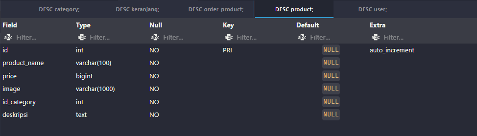

# Backup & Restore Database And GIT

## Create DB
- Create DB

- Create Table Category

- Create Table Product

- Create Table Keranjang

- Create Table Order Product

- Create Table User

- Describe Tables

## GIT and GITHUB
- Check Git

- Create Repo

- Try Push

- Create New Branch

- Add Collaborator
